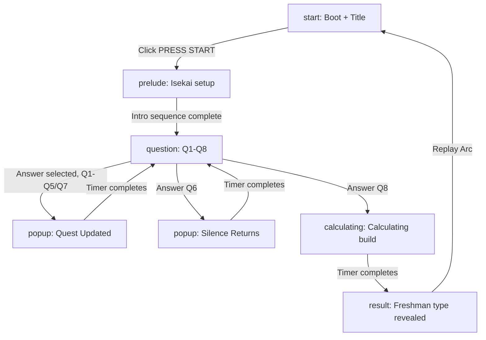

# What NBS Freshman Are You? - Storyboard and Production Asset Brief

Draft based on the current working prototype.

Purpose: this document explains the full quiz flow, player inputs, system outputs, scoring results, and final graphics required for student designer collaboration. Current generated images are treated as placeholders only.

## 1. Experience Summary

The quiz behaves like a short RPG / system-HUD story. The player is "transported" into an NBS freshman world, clears eight events, and receives one of six freshman personality builds.

Core rules:

- The player should feel like they are inside an RPG system, not filling in a normal web form.
- Narrative copy appears in the main dialogue box.
- System notices appear as separate HUD toasts, never as normal narrative text.
- Important warnings appear as threat banners with warning SFX and screen shake.
- Some questions use multiple story beats before options appear.
- Options are hidden until the relevant narrative beat, toast, popup, or foreground entity is complete.
- Scoring is hidden from the player until the result screen for fairness.
- Emojis should not be rendered in final UI text. The app strips them from text.

## 2. Global Interaction Rules

| Player/System Input | Condition | Output |
|---|---|---|
| Page loads | App starts at `start` phase | Boot sequence begins on black/title screen. |
| Timer advances boot message | During title boot | System HUD changes from system update to sync to welcome. |
| Click title screen / press start | Title screen visible | SFX unlocks, awakening transition plays, app enters prelude. |
| Click active dialogue while text is typing | Any narrative question/prelude box | Typewriter skips to full text immediately. |
| Click active dialogue after a story beat finishes | Only when "Click to continue" is shown | Moves to the next scripted beat or triggers the next popup/toast. |
| Click answer A/B/C/D | Options are visible | Plays option SFX, records answer, adds weighted scores, updates quest log. |
| Wait after answer interstitial | Not final question | Moves to next question after transition delay. |
| Close artifact popup | Group chat / monster / portal popup is open | Returns to question and shows a small artifact token for reopening. |
| Click artifact token | Artifact has already been discovered | Reopens the artifact popup without changing quiz state. |
| Click Quest Archive | Any non-story gameplay state | Opens completed event archive as a modal over a dimmed background. |
| Click backdrop / press any key in archive | Archive modal open | Closes archive and returns to current gameplay state. |
| Toggle SFX | Any quiz state after start | SFX on/off changes without regenerating the question or resetting progress. |
| Click Replay Arc | Result screen | Resets all quiz state and returns to start/title flow. |

## 3. Top-Level State Machine

## 4. Top-Level State Inputs and Outputs

| State | Main Input | Visual Output | System Output | Next State |
|---|---|---|---|---|
| `start.boot.system` | Automatic timer | Black/title boot screen, system HUD notice | "System update in progress." | `start.boot.sync` |
| `start.boot.sync` | Automatic timer | System HUD notice with scan effect | "Player signature detected. Synchronising player profile." | `start.boot.welcome` |
| `start.boot.welcome` | Automatic timer | System HUD notice | "Welcome, Player. The Freshman Arc has begun." | `start.title` |
| `start.title` | Click anywhere on title screen | Pixel title screen, blinking "PRESS START" | Boot/start SFX | `prelude` |
| `prelude` | Typing, timers, optional skip click | Narrative box and system notices | Arrival, quest log update, objective unlock | `question` Q1 |
| `question` | Dialogue click, popup close, option click | Question scene, options, toasts, story artifacts | Scores and answers stay hidden | `popup`, `calculating`, or next sub-phase |
| `popup` | Timer or popup display completion | Quest updated / story interstitial | Selected answer is logged | Next question or calculating |
| `calculating` | Automatic timer | "Calculating build..." loader | Winner selected by weighted score | `result` |
| `result` | Replay Arc click | Profile card | Personality profile, tips, tags | `start` |

## 5. Opening Storyboard

| State ID | Input | Output | Designer Notes |
|---|---|---|---|
| Start Boot 1 | Page load | Centered system HUD: "System update in progress." | Use same visual language as in-game system notices. |
| Start Boot 2 | Timer | Centered system HUD: "Player signature detected. Synchronising player profile." | Include scanning/link animation. |
| Start Boot 3 | Timer | Centered system HUD: "Welcome, Player. The Freshman Arc has begun." | Should feel official and clean, not like a form notification. |
| Title Screen | Timer after boot | Full title artwork with "PRESS START" blinking at bottom | No dialogue panel on title screen. |
| Start Input | Player clicks title | Awakening/transport transition, SFX | Transition into WCY Plaza world. |
| Prelude 1 | Auto after start | Narrative: first week at NBS, walking into WCY Plaza, air feels off, lights flicker | Main narrative dialogue box. |
| Prelude 2 | Timer | System HUD: "System update in progress." | System layer, not dialogue box. |
| Prelude 3 | Timer | System HUD: "Welcome, Player. The Freshman Arc has begun." | System layer. |
| Prelude 4 | Timer | Quest HUD: "Quest Log Updated. Complete events to determine your build." | Must remain readable long enough. |
| Prelude 5 | Timer/typewriter | Narrative: "The plaza glitches out." / "...Did I just get isekai'd into NBS?" | Transport/rift effect. |
| Prelude 6 | Timer | System HUD: "New Objective Unlocked. Attend The Orientation." | Leads into Q1. |

## 6. Question Storyboards

### Q1 - Character Spawn

Scene: WCY Plaza entrance.

| Sub-State | Input | Output | Next |
|---|---|---|---|
| Q1.0 Dialogue | Scene ready; player may click to skip typing | Narrative box: "You have spawned back at the WCY Plaza entrance. 4 starter packs materialise in front of you. Which do you pick?" | Options reveal after typing and delay. |
| Q1.1 Options | Player chooses A/B/C/D | Score weights are added; "Quest Updated" interstitial appears | Q2 scene transition. |

### Q2 - The Orientation Arena

Scene: Orientation arena / crowded university hall or plaza.

| Sub-State | Input | Output | Next |
|---|---|---|---|
| Q2.0 Observation Sequence | Scene ready; player may skip typing | Type sequence: "You enter WCY Plaza and suddenly observe:" then "Loud cheers", "Seniors hyping the crowd", "Friend groups forming in real time." | Event reveal. |
| Q2.1 Event Reveal | Automatic after typing | Toast: "Event: The Orientation. Difficulty: ???" | Options reveal after toast. |
| Q2.2 Options | Player chooses A/B/C/D | Score weights are added; "Quest Updated" interstitial appears | Q3 scene transition. |

### Q3 - Finding Your Class

Scene: WCY Plaza entrance, then navigation challenge.

| Sub-State | Input | Output | Next |
|---|---|---|---|
| Q3.0 Time Passage | Scene ready | Full-screen "Few Days Later" / timeline sync scene appears | Player clicks to continue. |
| Q3.1 Return to Plaza | Player click | Narrative: "You blink - and you're back at the WCY Plaza entrance again." | Player clicks to continue. |
| Q3.2 Objective Toast | Player click from Q3.1 | Toast: "New Objective Unlocked. Attend Your First Class." | Navigation text begins. |
| Q3.3 Navigation Problem | Auto after objective | Narrative: "You start walking. Left turn. Right turn. Another corridor. You are unable to find your class. What's your next move?" | Navigation toast. |
| Q3.4 Navigation Challenge | Automatic after typing | Toast: "NAVIGATION CHALLENGE INITIATED. Pathfinding module unstable." | Options reveal after toast. |
| Q3.5 Options | Player chooses A/B/C/D | Score weights are added; "Quest Updated" interstitial appears | Q4 scene transition. |

### Q4 - Group Project

Scene: Classroom / lecture theatre.

| Sub-State | Input | Output | Next |
|---|---|---|---|
| Q4.0 Classroom Setup | Scene ready; player may skip typing | Narrative: player reaches classroom, prof says "Form groups", classmates cluster, player enters a group chat | Player clicks to continue. |
| Q4.1 Group Chat Popup | Player click | Popup: "Biz Case grp 3" group chat UI. Background is dimmed. | Player closes popup. |
| Q4.2 Artifact Token | Popup close | Small group chat token remains on screen for reopening | Silence text begins. |
| Q4.3 Silence Beat | Auto after popup close | Narrative: "No one says anything. What do you do?" | Event toast. |
| Q4.4 Event Toast | Automatic after typing | Toast: "Event: Group Project. Team dynamics unknown." | Options reveal after toast. |
| Q4.5 Options | Player chooses A/B/C/D | Score weights are added; "Quest Updated" interstitial appears | Q5 scene transition. |

### Q5 - The CCA Fair

Scene: CCA fair / lively plaza with booths.

| Sub-State | Input | Output | Next |
|---|---|---|---|
| Q5.0 Leaving Campus | Scene ready; player may skip typing | Narrative: "Class ends. You try to leave campus. You think you're finally done. the game: lol no" | Player clicks to continue. |
| Q5.1 Reroute Beat | Player click | Narrative: "Your path automatically reroutes." with visual glitch on "reroutes" | Player clicks to continue. |
| Q5.2 Route Update Toast | Player click from Q5.1 | Toast: "Route Updated. Returning to WCY Plaza." | CCA fair arrival text begins. |
| Q5.3 Louder Plaza | Auto after toast/phase | Narrative: player is back at WCY Plaza; surroundings are louder | Player clicks to continue. |
| Q5.4 CCA Pressure | Player click | Narrative: tote bag, pitches, unplanned commitment pressure, "Your move?" | Event toast. |
| Q5.5 Event Toast | Automatic after typing | Toast: "Event: The CCA Fair. Campus path has been rerouted." | Options reveal after toast. |
| Q5.6 Options | Player chooses A/B/C/D | Score weights are added; "Quest Updated" interstitial appears | Q6 scene transition. |

### Q6 - The Burnout Monster

Scene: Burnout-dark environment.

| Sub-State | Input | Output | Next |
|---|---|---|---|
| Q6.0 Threat Setup | Scene ready; player may skip typing | Narrative: "The environment suddenly darkens." | Player clicks to continue. |
| Q6.1 UI Attack | Player click | Four notification badges stack around screen edges: deadline, meeting, unread, "are you free?" Each appears with notification SFX. | Auto proceeds to next script. |
| Q6.2 Overload Setup | Automatic after notification stack | Narrative: "It doesn't stop. Then:" | Warning toast. |
| Q6.3 System Overload | Automatic after typing | Red warning: "WARNING: SYSTEM OVERLOAD. Stress meter exceeding recommended limits." with warning SFX and shake | Auto proceeds to figure text. |
| Q6.4 Figure Forms | Automatic after warning | Narrative: "A figure forms." | Monster popup auto opens. |
| Q6.5 Boss Popup | Automatic after Q6.4 | Popup: Burnout Monster foreground image, boss encounter copy, dimmed background | Player closes popup. |
| Q6.6 Artifact Token | Popup close | Small boss token remains for reopening | Final action text begins. |
| Q6.7 Player Action | Auto after popup close | Narrative: "The Burnout Monster remains in front of you. You are not prepared. Choose a strategy:" | Options reveal. |
| Q6.8 Options | Player chooses A/B/C/D | Score weights are added; "Silence Returns" popup appears | Q7 scene transition. |
| Q6.9 Silence Returns | Automatic after answer | Popup: notifications slow down, monster disappears, disappearance SFX | Q7 after timer. |

### Q7 - Finals Mode

Scene: Burnout/finals warning environment.

| Sub-State | Input | Output | Next |
|---|---|---|---|
| Q7.0 Silence Delay | Scene ready | UI briefly holds silence / empty stage | Finals warning. |
| Q7.1 Finals Warning | Automatic after silence | Red warning: "FINALS IN 14 DAYS. Revision timer activated." with warning SFX and shake | Finals dialogue begins. |
| Q7.2 Finals Dialogue | Auto after warning; player may skip typing | Narrative: "Then, before you can catch a break: 'FINALS IN 14 DAYS.' Time speeds up. Days feel shorter. You check the calendar. What now?" | Options reveal. |
| Q7.3 Options | Player chooses A/B/C/D | Score weights are added; "Quest Updated" interstitial appears | Q8 scene transition. |

### Q8 - Weekend Portal

Scene: Weekend portal dimension.

| Sub-State | Input | Output | Next |
|---|---|---|---|
| Q8.0 Portal Appears | Scene ready; player may skip typing | Narrative: "A glowing portal opens in front of you." | Player clicks to continue. |
| Q8.1 Portal Popup | Player click | Popup: glowing Weekend Portal foreground image, dimmed background | Player closes popup. |
| Q8.2 Artifact Token | Popup close | Small portal token remains for reopening | Final portal question begins. |
| Q8.3 Portal Question | Auto after popup close; player may skip typing | Narrative: "A glowing portal opens in front of you. What do you do?" | System instance toasts. |
| Q8.4 Instance Toast 1 | Automatic after typing | Toast: "WEEKEND INSTANCE AVAILABLE (48 HOURS ONLY)" | Second toast. |
| Q8.5 Instance Toast 2 | Automatic after first toast | Toast: "ALERT: TIME RESOURCE MUST BE ALLOCATED" | Options reveal. |
| Q8.6 Options | Player chooses A/B/C/D | Final score weights are added | Calculating screen. |

## 7. Complete Option and Scoring Matrix

Outcome key:

- Overachiever
- Social Butterfly
- Lost but Vibing
- Soft Supporter
- We Ball Agent
- Lowkey Strategist

Tie-breaker logic:

1. Highest total weighted score wins.
2. If tied, the outcome with more primary-outcome selections wins.
3. If still tied, the most recent selected primary outcome wins.
4. If still unresolved, the first outcome in internal order wins.

### Q1 - Character Spawn

| Input | Player-Facing Option | Action Title | Hidden Score Output | Primary Tie-Breaker |
|---|---|---|---|---|
| A | Planner, highlighters, colour-coded timetable | Equip the Master Planner | Overachiever +2, Lowkey Strategist +1 | Overachiever |
| B | AirPods, iced coffee/matcha, vibes only | Activate Vibe Mode | Social Butterfly +1, Lost but Vibing +2 | Lost but Vibing |
| C | Emotional support item + snacks | Pack the Comfort Kit | Soft Supporter +2, Lost but Vibing +1 | Soft Supporter |
| D | "I'll figure it out later" energy | Select Mystery Loadout | We Ball Agent +2, Lost but Vibing +1 | We Ball Agent |

### Q2 - The Orientation Arena

| Input | Player-Facing Option | Action Title | Hidden Score Output | Primary Tie-Breaker |
|---|---|---|---|---|
| A | Smile politely, observe, then join a group strategically | Scan, Smile, Sync | Lowkey Strategist +2, Overachiever +1 | Lowkey Strategist |
| B | Talk to EVERYONE. You now have 12 new friends | Cast Mass Friendship | Social Butterfly +3 | Social Butterfly |
| C | Stick to 1-2 people and trauma bond quietly | Form a Small Party | Soft Supporter +2, Lowkey Strategist +1 | Soft Supporter |
| D | Stand there until someone adopts you | Wait for Party Invite | Lost but Vibing +2, Soft Supporter +1 | Lost but Vibing |

### Q3 - Finding Your Class

| Input | Player-Facing Option | Action Title | Hidden Score Output | Primary Tie-Breaker |
|---|---|---|---|---|
| A | Google Maps + NTU map + walk faster like it's intentional | Triangulate Route | Overachiever +1, Lowkey Strategist +2 | Lowkey Strategist |
| B | Ask a random senior: "hi sorry where is LT5" | Request Senior Intel | Social Butterfly +2, Soft Supporter +1 | Social Butterfly |
| C | Pretend you know where you're going while slowly spiralling | Maintain Main Character Walk | Lost but Vibing +2, Lowkey Strategist +1 | Lost but Vibing |
| D | Just go back to hostel | Abort Mission | We Ball Agent +2, Lost but Vibing +1 | We Ball Agent |

### Q4 - Group Project

| Input | Player-Facing Option | Action Title | Hidden Score Output | Primary Tie-Breaker |
|---|---|---|---|---|
| A | "Let's assign roles + timeline + Google Doc NOW." | Open the War Room | Overachiever +2, Lowkey Strategist +1 | Overachiever |
| B | "Guys let's get to know each other first hehe" | Cast Icebreaker | Social Butterfly +2, Soft Supporter +1 | Social Butterfly |
| C | "I'll just do my part... y'all don't worry" | Quietly Take a Lane | Soft Supporter +2, Lowkey Strategist +1 | Soft Supporter |
| D | "We ball." | Enable Chaos Protocol | We Ball Agent +3 | We Ball Agent |

### Q5 - The CCA Fair

| Input | Player-Facing Option | Action Title | Hidden Score Output | Primary Tie-Breaker |
|---|---|---|---|---|
| A | Research all CCAs before committing | Audit Every Booth | Overachiever +1, Lowkey Strategist +2 | Lowkey Strategist |
| B | Sign up for everything. Future you problem | Collect All Side Quests | Social Butterfly +2, We Ball Agent +1 | Social Butterfly |
| C | Walk around, take freebies, disappear | Loot and Evade | Lost but Vibing +2, We Ball Agent +1 | Lost but Vibing |
| D | Join because your friend joined | Follow Party Leader | Soft Supporter +2, Social Butterfly +1 | Soft Supporter |

### Q6 - The Burnout Monster

| Input | Player-Facing Option | Action Title | Hidden Score Output | Primary Tie-Breaker |
|---|---|---|---|---|
| A | Lock in. Finish everything first | Full Focus Burst | Overachiever +2, Lowkey Strategist +1 | Overachiever |
| B | Text friends: "guys i cannot" | Call for Backup | Social Butterfly +1, Soft Supporter +2 | Soft Supporter |
| C | Take a nap. Reset. | Use Recovery Potion | Lost but Vibing +2, Soft Supporter +1 | Lost but Vibing |
| D | Exist in stress. Romanticise suffering a bit | Dramatic Endurance Mode | We Ball Agent +2, Overachiever +1 | We Ball Agent |

### Q7 - Finals Mode

| Input | Player-Facing Option | Action Title | Hidden Score Output | Primary Tie-Breaker |
|---|---|---|---|---|
| A | Already started revision last week | Execute Revision Plan | Overachiever +2, Lowkey Strategist +1 | Overachiever |
| B | "Okay let's study... after this one outing" | Balance Study and Side Quest | Social Butterfly +2, Lost but Vibing +1 | Social Butterfly |
| C | "Still got time lah" | Delay the Countdown | Lost but Vibing +2, We Ball Agent +1 | Lost but Vibing |
| D | Panic. Do nothing. Spiral a bit. | Enter Spiral Cutscene | We Ball Agent +2, Soft Supporter +1 | We Ball Agent |

### Q8 - Weekend Portal

| Input | Player-Facing Option | Action Title | Hidden Score Output | Primary Tie-Breaker |
|---|---|---|---|---|
| A | Catch up on studies + get ahead | Preload Next Week | Overachiever +2, Lowkey Strategist +1 | Overachiever |
| B | Hang out, cafe hop, live life | Enter Social Free Roam | Social Butterfly +2, We Ball Agent +1 | Social Butterfly |
| C | Sleep. Recover. Heal. | Restore HP | Soft Supporter +2, Lost but Vibing +1 | Soft Supporter |
| D | Start on something productive... then end up doomscrolling | Open Productivity Mirage | Lost but Vibing +2, We Ball Agent +1 | Lost but Vibing |

## 8. Result Outputs

| Winning Outcome | Result Name | Motto | Traits | Personality Tags | Wellbeing Tips |
|---|---|---|---|---|---|
| Overachiever | The Overachiever | "If I'm here, I'm going to excel." | Driven, Organised, Ambitious | #Ambitious, #Disciplined, #FutureCEO | Rest is okay; do not constantly compare; schedule breaks. |
| Social Butterfly | The Social Butterfly | "Connections are everything." | Outgoing, Friendly, Energetic | #ExtrovertCore, #MainCharacter, #Networker | Say no sometimes; protect energy; make time for yourself. |
| Lost but Vibing | The Lost but Vibing | "I'll figure it out... eventually." | Chill, Adaptable, Go-with-the-flow | #JustVibing, #ItIsWhatItIs, #NoThoughtsHeadEmpty | Add a little structure; ask for help earlier; you do not need everything figured out. |
| Soft Supporter | The Soft Supporter | "We'll get through this together." | Caring, Dependable, Emotionally aware | #GroupMom, #ComfortHuman, #WholesomeCore | Prioritise yourself; set boundaries; do not carry everyone's problems. |
| We Ball Agent | The "We Ball" Agent | "No plan." | Spontaneous, Chaotic, Bold | #LastMinuteGod, #ChaosEnergy, #WeBall | Reduce stress for future self; start slightly earlier; burnout is not fun. |
| Lowkey Strategist | The Lowkey Strategist | "Work smart, not loud." | Observant, Calculated, Efficient | #SilentCarry, #BigBrain, #LowkeyWinning | Do not isolate too much; let others see effort; balance efficiency with connection. |

Result screen output:

- Freshman type name
- Motto
- Traits
- Personality tags
- Profile description
- Wellbeing tips
- Replay Arc button

## 9. Graphics Needed From Student Designer

All final graphics should be produced in a consistent 8-bit / pixel-art RPG style with a Solo Leveling-inspired system HUD feeling. Avoid embedding modern emojis inside final art. Keep text in separate UI layers where possible so copy can be edited in code.

### A. Backgrounds

| Asset ID | Use | Suggested Delivery | Notes |
|---|---|---|---|
| `bg-title-screen` | Start title screen | 16:9 PNG/WebP, 1920x1080 minimum | Title artwork with clear central composition. Text can be separate if designer prefers. |
| `bg-wcy-plaza-gate` | Prelude, Q1, Q3 | 16:9 PNG/WebP | NBS/WCY Plaza entrance, readable foreground, enough dark/empty space for dialogue panels. |
| `bg-orientation-arena` | Q2 | 16:9 PNG/WebP | Crowded plaza/hall, stage, cheers, seniors, high energy. |
| `bg-classroom` | Q4 | 16:9 PNG/WebP | Lecture theatre/classroom with groups forming. |
| `bg-cca-fair` | Q5 | 16:9 PNG/WebP | Lively fair booths, banners, tote bags, campus crowd. |
| `bg-burnout-lair` | Q6 and Q7 | 16:9 PNG/WebP | Dark glitchy environment, pressure/stress atmosphere, space for monster foreground. |
| `bg-weekend-portal-dimension` | Q8 | 16:9 PNG/WebP | Mystical portal world, not WCY Plaza, should support glowing foreground portal. |
| `bg-result-reveal` | Result screen | 16:9 PNG/WebP or reusable environment variant | Optional but useful: calmer reveal background after quiz completion. |

### B. Foreground Story Artifacts

| Asset ID | Use | Suggested Delivery | Notes |
|---|---|---|---|
| `fg-group-chat-biz-case-grp-3` | Q4 popup and token | Transparent PNG/WebP, 1:1 or 4:5 | Retro smartphone/chat UI titled "Biz Case grp 3"; no long readable text required. |
| `fg-burnout-monster-idle` | Q6 boss popup and token | Transparent PNG/WebP, 1:1, 1200px+ | Main Burnout Monster design. Should be readable when scaled down. |
| `fg-burnout-monster-disappear` | Q6 answer interstitial/Q7 transition | Transparent PNG/WebP or short sprite | Same monster dissolving/fading, with stress particles disappearing. |
| `fg-weekend-portal` | Q8 popup and token | Transparent PNG/WebP, 1:1, 1200px+ | Glowing portal/rift that can pulse in CSS. |
| `fg-notification-deadline` | Q6 notification stack | Transparent PNG/WebP or UI sprite | Deadline notification badge/card. |
| `fg-notification-meeting` | Q6 notification stack | Transparent PNG/WebP or UI sprite | Meeting/call notification badge/card. |
| `fg-notification-unread` | Q6 notification stack | Transparent PNG/WebP or UI sprite | Unread message notification badge/card. |
| `fg-notification-are-you-free` | Q6 notification stack | Transparent PNG/WebP or UI sprite | Social request notification badge/card. |

### C. UI Frames and HUD Components

| Asset ID | Use | Suggested Delivery | Notes |
|---|---|---|---|
| `ui-narrative-dialogue-frame` | Main story/question box | PNG frame or CSS reference sheet | Dark slate, readable, muted borders, enough padding. |
| `ui-system-hud-info` | Blue/cyan system toasts | PNG frame or style guide | Sharp corners, neon cyan, geometric brackets. |
| `ui-system-hud-event` | Quest/event toasts | PNG frame or style guide | Gold/yellow accent variant. |
| `ui-system-hud-warning` | Threat warnings | PNG frame or style guide | Crimson/red, glitch-ready, strong contrast. |
| `ui-option-button` | A-D choices | PNG/CSS reference | Four states needed: normal, hover/focus, selected, disabled/loading. |
| `ui-quest-status-rail` | Top status rail | PNG/CSS reference | Quest count, active objective, progress nodes, archive button. |
| `ui-quest-archive-modal` | Completed event archive | PNG/CSS reference | Separate popup window with dimmed background. |
| `ui-artifact-token` | Small reopened artifact buttons | PNG/CSS reference | Chat/Boss/Portal tokens after popup has been seen. |
| `ui-result-profile-card` | Final personality card | PNG/CSS reference | Must support name, motto, traits, tags, profile, tips. |
| `ui-press-start-prompt` | Title screen prompt | Text style reference | Blinking retro prompt. Can be CSS text rather than image. |

### D. Result Character/Profile Art

Optional but recommended for a more polished review build.

| Asset ID | Use | Suggested Delivery | Notes |
|---|---|---|---|
| `avatar-overachiever` | Result profile | Transparent PNG/WebP, 1:1 | Planner/CEO/internship-ready visual language. |
| `avatar-social-butterfly` | Result profile | Transparent PNG/WebP, 1:1 | Friendly/networking/social energy. |
| `avatar-lost-but-vibing` | Result profile | Transparent PNG/WebP, 1:1 | Chill, confused but surviving. |
| `avatar-soft-supporter` | Result profile | Transparent PNG/WebP, 1:1 | Warm, dependable group support role. |
| `avatar-we-ball-agent` | Result profile | Transparent PNG/WebP, 1:1 | Chaotic last-minute confidence. |
| `avatar-lowkey-strategist` | Result profile | Transparent PNG/WebP, 1:1 | Quiet, observant, efficient planner. |

### E. Effect References

These can be delivered as style frames, short sprite loops, or simply approved references for implementation in CSS.

| Effect | Use | Designer Output Needed |
|---|---|---|
| System boot scan | Start sequence | Visual reference for scan line / profile sync animation. |
| Scene crossfade mood | Between questions | Style direction for transition overlays. |
| WCY ambient flicker | Prelude/Q1/Q3 | Light/particle reference. |
| Orientation crowd energy | Q2 | Optional animated crowd/light accents. |
| Time passage / Few Days Later | Q3 | Make it consistent with the game HUD, less corporate, more RPG timeline sync. |
| Reroute glitch | Q5 | Red/cyan text glitch reference for "reroutes". |
| Burnout UI attack | Q6 | Notification stacking motion style. |
| Threat warning shake/glitch | Q6/Q7 | Warning banner and screen shake style frame. |
| Portal pulse | Q8 | Centered magical pulse; no rotating full background. |
| Result reveal | Result screen | Optional celebratory reveal effect. |

## 10. Sound Effects Needed

The app currently generates simple synth SFX in code. For a production event build, custom audio would improve polish.

| SFX ID | Trigger | Mood |
|---|---|---|
| `sfx-system-boot` | Title boot/title reveal | Short system startup chime. |
| `sfx-text-beep` | Typewriter ticks | Soft retro dialogue beep. |
| `sfx-option-select` | Answer click | Confirm/select tone. |
| `sfx-quest-toast` | Quest/event HUD | Reward/update chime. |
| `sfx-navigation-toast` | Route/navigation notices | Map/pathfinding tone. |
| `sfx-warning` | Burnout/finals warnings | Low urgent alert. |
| `sfx-notification-stack` | Q6 deadlines/meetings/unread popups | Layered notification pings. |
| `sfx-monster-spawn` | Burnout Monster popup | Boss encounter hit. |
| `sfx-monster-disappear` | Silence Returns | Stress release/fade out. |
| `sfx-portal-open` | Weekend Portal popup | Magical gate opening. |
| `sfx-result-reveal` | Result screen | Completion/reveal fanfare. |

## 11. Designer Handoff Notes

- Keep all major UI text readable at laptop and mobile sizes.
- Avoid placing important art details under the central dialogue panel unless intentionally decorative.
- Keep backgrounds darker or lower-contrast behind text-safe areas.
- Do not put final copy directly into images unless the text is part of the artifact itself, such as "Biz Case grp 3".
- Give foreground artifacts transparent backgrounds so they can be reused in popup and token form.
- For every major foreground asset, provide a small-crop version or ensure it still reads clearly when reduced to an artifact token.
- Prioritise these first: `bg-wcy-plaza-gate`, `bg-orientation-arena`, `bg-classroom`, `bg-cca-fair`, `bg-burnout-lair`, `bg-weekend-portal-dimension`, `fg-burnout-monster-idle`, `fg-weekend-portal`, `fg-group-chat-biz-case-grp-3`, notification badges, and the three HUD frame variants.

